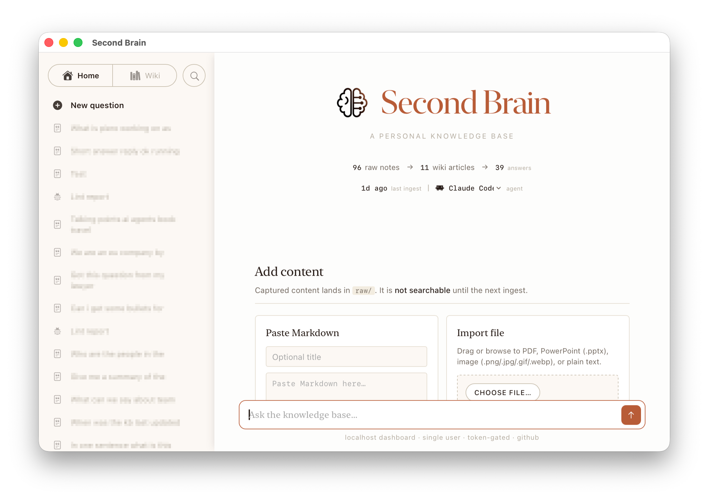

# Second Brain
A personal knowledge base that lives in this folder. Drop content in, have it organized automatically, ask questions, and get sourced answers — through **Claude Code**, **OpenAI Codex** skills, or a **local web dashboard** (available as a downloadable [macOS app](https://github.com/PieroSierra/SecondBrain/releases/latest)).

---

## START HERE — first run

Just cloned this? Do these steps **in order**. It's the same in Claude Code or Codex.

1. **Clone the repo** (your agent may have already done this).
2. **Restart your agent so it's running _inside_ the SecondBrain folder.** Agents
   load their skills and read config at startup, based on the folder they open in.
   If you cloned from your home directory, the `/second-brain-*` skills don't exist
   in that session yet — quit and reopen the agent here. *(Skipping this is the #1
   reason "the commands don't work.")*
3. **Run setup:** `/second-brain-setup` (Claude Code) or `$second-brain-setup`
   (Codex). It asks for your interests and engine, then writes your config.
4. **Restart your agent once more.** This loads the config setup just wrote. Now
   everything works.
5. **Start using it** — pick a path below.

> **No `CLAUDE.md` / `AGENTS.md` in the folder? That's expected.** They're
> generated by `/second-brain-setup` and are intentionally absent from a fresh
> clone. The `CLAUDE.md.example` / `AGENTS.md.example` files show what setup will
> create — you don't need to touch them by hand.

**Easiest (no terminal) — the app.** After setup, download
**[SecondBrain.app](https://github.com/PieroSierra/SecondBrain/releases/latest)**,
launch it, and point it at this folder. The dashboard re-reads your config every
time it starts, so there's no restart juggling. Best path for non-technical users.

**In your agent (CLI).** After the step-4 restart, try:
`/second-brain-import-md` → `/second-brain-ingest` → `/second-brain-query "…"`
(Codex: swap the leading `/` for `$`). Full command list is under
[Usage](#usage--claude-code--or-codex--skills) below.

---

## What it does

The system has three tiers:

| Folder     | Purpose                                                                         |
| ---------- | ------------------------------------------------------------------------------- |
| `raw/`     | Everything you capture. Append-only. Never modified by AI.                      |
| `wiki/`    | AI-organised topic articles with cross-links. Written only by the ingest skill. |
| `outputs/` | Query answers and lint reports, dated and saved automatically.                  |

Content flows in one direction: `raw/` → ingest → `wiki/` → query → `outputs/`.

---

## Prerequisites

- **An agent CLI on your PATH — either one:**
  - **Claude Code** (`claude`) — install from [claude.ai/code](https://claude.ai/code), then sign in. *(default)*
  - **OpenAI Codex** (`codex`) — install per [OpenAI's Codex CLI docs](https://developers.openai.com/codex/cli), then `codex login` (or set `CODEX_API_KEY`).

  Both run the **same** Second Brain skills; pick one at setup. Switch any time by changing `AGENT_ENGINE` in `.env`.
- **Python 3** (macOS system Python is fine — no `pip install` needed).
- (optional) The **Craft MCP** integration — configured in Claude Code's MCP settings, or in `~/.codex/config.toml` for Codex — if you want Craft import.

---

## First-time setup

```bash
/second-brain-setup     # Claude Code
$second-brain-setup     # Codex
```

This asks which agent engine you use (Claude Code or Codex), records it in `.env`, declares your interests, and writes the configuration file — `CLAUDE.md` and `AGENTS.md` both, so you can switch engines later. Run it once, or again any time you want to update your interests.

> **Restart after setup.** Skills and config load at agent startup, so quit and
> reopen your agent **inside this folder** once setup finishes — see
> [START HERE](#start-here--first-run) for the full first-run sequence.

---

## Agent engine — Claude Code or Codex

Every Second Brain operation is an [agent skill](https://agentskills.io) — a `SKILL.md` of plain instructions. **Claude Code** and **OpenAI Codex** run the *same* skills, so you can use whichever you prefer. The choice lives in one place: `AGENT_ENGINE` in `.env`.

|                          | Claude Code *(default)*                         | Codex                                            |
| ------------------------ | ----------------------------------------------- | ------------------------------------------------ |
| `.env`                   | `AGENT_ENGINE=claude`                           | `AGENT_ENGINE=codex`                             |
| Binary                   | `claude` (override with `CLAUDE_BIN`)           | `codex` (override with `CODEX_BIN`)              |
| Invoke a skill by hand   | `/second-brain-query "…"`                       | `$second-brain-query "…"`                        |
| Config file it reads     | `CLAUDE.md`                                      | `AGENTS.md`                                       |
| Vault confinement        | per-tool allow/deny + vault-scoped `Write`      | `--sandbox workspace-write` rooted at the vault  |

`/second-brain-setup` writes **both** `CLAUDE.md` and `AGENTS.md` (identical content), and the canonical `.claude/skills/` tree is exposed to Codex through a `.agents/skills` link the dashboard creates automatically — so nothing else needs changing when you switch.

### Switching engines

1. Set `AGENT_ENGINE=codex` (or `claude`) in `.env` at the vault root.
2. Restart the dashboard with `./run.sh` — the value is read at startup.

That's the whole switch. The dashboard's top status bar shows the active engine (the **"… agent"** tile), and the rest of the vault — interests, raw content, wiki — is untouched by the choice. Custom binaries stay independent: `CLAUDE_BIN` is used only under `claude` and `CODEX_BIN` only under `codex`, so flipping back and forth always relaunches the right one.

> **Security note:** the two engines enforce the sandbox differently. Claude Code denies `Bash`/network and path-scopes writes to the vault; Codex confines writes to the vault via its sandbox but **can still run shell commands inside it** (there is no "deny `Bash`" in Codex). Read [`dashboard/README.md`](dashboard/README.md#security-model) before choosing for an untrusted-content workflow.

---

## Usage — Claude Code (`/`) or Codex (`$`) skills

All knowledge-base operations are agent skills. Run them by typing the skill name in a session open to this folder — prefixed with `/` under Claude Code or `$` under Codex (e.g. `/second-brain-query "…"` or `$second-brain-query "…"`). The commands below show the Claude Code form; swap the leading `/` for `$` on Codex.

### Capture

You can also drop files directly into `raw/` — a `.md` note, a PDF, even an image — and they will be picked up on the next `/second-brain-ingest`. The skills below are convenience wrappers that handle conversion (e.g. PDF text extraction) and Craft/web fetching before writing to `raw/`.

| Command                                          | What it does                                                            |
| ------------------------------------------------ | ----------------------------------------------------------------------- |
| `/second-brain-import-md`                           | Save a pasted Markdown note into `raw/`                                   |
| `/second-brain-import-file "<path>"`                | Import any file — PDF → `raw/pdf/`, image → `raw/images/`, text → `raw/` |
| `/second-brain-import-pdf <path>`                   | Extract and save a PDF into `raw/pdf/` (also used by ingest internally)   |
| `/second-brain-import-craft Folder/DocumentName`    | Pull a named note from Craft into `raw/craft/`                            |
| `/second-brain-import-web <url>`                    | Fetch a webpage and save it into `raw/web/`                               |

### Organise

| Command                                              | What it does                                                                                |
| ---------------------------------------------------- | ------------------------------------------------------------------------------------------- |
| `/second-brain-ingest`                               | Read new or changed files in `raw/`, update `wiki/` articles, rebuild `INDEX.md`            |
| `/second-brain-lint`                                 | Scan the wiki for contradictions, unsupported claims, and gaps; save a report to `outputs/` |
| `/second-brain-edit-wiki "<prompt>" [<slug>]`        | Apply a natural-language edit to one or more wiki articles; preserves sources footer and wikilinks |

### Retrieve

| Command | What it does |
|---|---|
| `/second-brain-query "your question here"` | Ask the knowledge base a natural-language question; answer saved to `outputs/` |

### Notes

- Ingest is **explicit** — new content in `raw/` does not appear in the wiki until you run `/second-brain-ingest`.
- The wiki is **AI-managed** — never edit files in `wiki/` directly.
- `raw/` is **append-only** — never delete or modify files there.

---

## Usage — Interactive dashboard

The dashboard is a local web UI that surfaces the same six operations without opening a terminal.


### macOS app (easiest on Mac)

Prefer a real app to running a script? Download **SecondBrain.app** — a signed, notarized macOS app that runs the dashboard for you: it starts the bridge, shows the dashboard in its own window, lives in the Dock while running, lets you switch engine (Claude ↔ Codex) from a menu, and shuts the bridge down when you quit.

**[⬇ Download SecondBrain.app](https://github.com/PieroSierra/SecondBrain/releases/latest)** — notarized, so it opens with a normal double-click (no right-click, no Gatekeeper prompt).

It's a companion to this repo, not a standalone download: clone the repo and have an agent CLI (`claude` or `codex`) on your PATH, then point the app at your vault folder on first launch. Build it yourself or read more in [`macos-app/README.md`](macos-app/README.md).

### Start from the terminal

```bash
./run.sh
```

The bridge prints `http://127.0.0.1:4173/` and opens it in your browser. Stop with `Ctrl-C`.

`run.sh` is idempotent — if the port is already occupied by a previous bridge it kills it before starting a fresh one.

### Custom port

```bash
PORT=4180 ./run.sh
# or directly:
python3 dashboard/bridge.py --port 4180 --no-open
```

### What the dashboard provides

- **Hero query box** — ask a question and read the rendered answer directly in the page.
- **Navigation bar** — browse past answers and wiki articles.
- **Import controls** — paste Markdown, drop/select any file (PDF, image, plain text), import from a URL, or specify a Craft folder and document name.
- **Ingest / Lint buttons** — trigger wiki maintenance and view the results inline.
- **Wiki edit boxes** — after a lint report runs, or while viewing any wiki article, a suggestion box lets you describe an edit in plain English and apply it directly without touching files manually.
- **Status strip** — wiki article count, pending raw items, and last ingest time, derived from the filesystem with no model call.

### How it works

The dashboard is a static HTML page. Every long operation fires a `POST /run` request to a tiny Python bridge (`dashboard/bridge.py`) which execs the configured agent — `claude -p "/second-brain-..." --output-format json`, or `codex exec "$second-brain-..." --sandbox workspace-write` when `AGENT_ENGINE=codex` — and streams the result back. The bridge has no knowledge-base logic of its own — the skills are the only system of record.

### Chrome extension

A companion browser extension lets you import any page directly from Chrome without opening the dashboard first. It connects to the same local bridge, so the bridge must be running.

**Install (one-time):**

1. Open Chrome and navigate to `chrome://extensions`.
2. Enable **Developer mode** (toggle in the top-right corner).
3. Click **Load unpacked**.
4. Select the `chrome-extension/` folder at the root of this repo.

The "Second Brain Importer" extension will appear in your toolbar (pin it for easy access).

> On the Mac app, you can also use **App → Install Browser Extension…**, which
> reveals the `chrome-extension/` folder in Finder and opens `chrome://extensions`
> for you — then just do steps 2–4 above.

**Usage:**

1. Start the bridge with `./run.sh` (or keep it running in the background).
2. Browse to any page you want to capture.
3. Click the Second Brain icon in your toolbar and press **Import this page**.

The extension extracts the page's main content, converts it to Markdown, and saves it to `raw/web/` — identical to `/second-brain-web-import` but triggered from the browser. For paywalled pages where the extension can't extract content, use `/second-brain-web-import` with paste mode instead.

### Local settings (.env)

Create a `.env` file at the vault root to override defaults without editing any code:

```
# Which agent CLI backs the skills: claude (default) or codex.
AGENT_ENGINE=claude

# Use a different claude binary (e.g. a Max subscription account):
CLAUDE_BIN=claude-personal

# Use a different codex binary (used when AGENT_ENGINE=codex):
CODEX_BIN=codex

# Show the Craft import card in the dashboard (Craft MCP must be configured for your engine):
CRAFT_ENABLED=1
```

The `.env` file is gitignored — it never leaves your machine.

### Permissions

The dashboard runs each skill **without** `bypassPermissions`. The bridge grants only the tools a skill needs, denies `Bash`/network/subagent tools outright, and confines `Write`/`Edit` to this folder — so a prompt-injection in imported content can't run commands or write outside the vault. It also gates every request with a per-session token and an `Origin` check so other web pages can't drive it. See [`dashboard/README.md`](dashboard/README.md#security-model) for the full model.

Avoid "fixing" a permission denial by adding bare `Write`, `Edit`, or `Bash` to `permissions.allow` in `.claude/settings.local.json` — that re-opens the vault-escape hole. Add the narrowest (path- or command-scoped) rule instead.

### Troubleshooting

| Symptom | Fix |
|---|---|
| "Connection refused" in the browser | The bridge isn't running — start it with `./run.sh`. |
| `claude: command not found` in the bridge log | Ensure `claude` is on the PATH of the shell that launches the bridge, or set `CLAUDE_BIN` in `.env`. |
| `codex: command not found` in the bridge log | With `AGENT_ENGINE=codex`, ensure `codex` is on the PATH, or set `CODEX_BIN` in `.env`. |
| Long operation returns 504 | Skill timed out. Run the same prompt directly to debug: `claude -p "/second-brain-query \"...\"" --output-format json` (or `codex exec "$second-brain-query \"...\""`). |
| Status bar "agent" tile wrong, or change to `.env` ignored | The engine is read at startup — restart the bridge (`./run.sh`) after editing `AGENT_ENGINE`. |
| 409 Busy | Another operation is in flight — wait for it to finish. |
| Status strip shows `—` | `raw/.ingest-manifest.json` is missing; run `/second-brain-ingest` once to create it. |

---

## Project layout

```
SecondBrain/
├── raw/                        Source content (append-only)
│   ├── craft/                  Notes imported from Craft
│   ├── pdf/                    Text extracted from PDFs
│   ├── images/                 Visual descriptions of imported images
│   ├── web/                    Pages fetched by web-import
│   └── .ingest-manifest.json   Machine-managed ingestion state
├── wiki/                       AI-organised topic articles
│   └── INDEX.md                Master topic index (rebuilt on every ingest)
├── outputs/                    Query answers and lint reports
├── .claude/skills/             Agent skills — the engine behind every command (Codex reads them via the .agents/skills link)
│   ├── second-brain-query/        ask the knowledge base
│   ├── second-brain-ingest/       fold raw/ into wiki/
│   ├── second-brain-lint/         scan the wiki for issues
│   ├── second-brain-edit-wiki/    apply natural-language edits to articles
│   ├── second-brain-import-{md,web,pdf,file,craft}/   capture content
│   └── second-brain-setup/        first-time configuration
├── dashboard/                  Local web UI
│   ├── bridge.py               Python stdlib HTTP server + claude/codex proxy
│   ├── index.html              Single-page dashboard
│   ├── styles.css              Visual design
│   ├── app.js                  Front-end controller
│   ├── lib/marked.min.js       Vendored Markdown renderer
│   └── lib/purify.min.js       Vendored DOMPurify (HTML sanitiser)
├── chrome-extension/           Browser extension (load unpacked in Chrome)
├── macos-app/                  Native macOS app that runs the dashboard (Swift source + build/release scripts)
├── run.sh                      Start the dashboard (idempotent port cleanup)
├── CLAUDE.md                   Vault schema + your declared interests (gitignored — personal)
├── CLAUDE.md.example           Template to copy when setting up a new vault
├── .env                        Local overrides: CLAUDE_BIN, CRAFT_ENABLED (gitignored)
└── specs/                      Feature specs and implementation plans
```

---

## Further reading

- `CLAUDE.md` — vault schema, folder rules, and your declared interests.
- `specs/001-personal-knowledge-base/spec.md` — PKB feature specification.
- `specs/002-interactive-dashboard/spec.md` — Dashboard feature specification.
- `specs/002-interactive-dashboard/plan.md` — Implementation plan and architecture.
- `specs/002-interactive-dashboard/contracts/bridge-http.md` — Bridge HTTP API.
