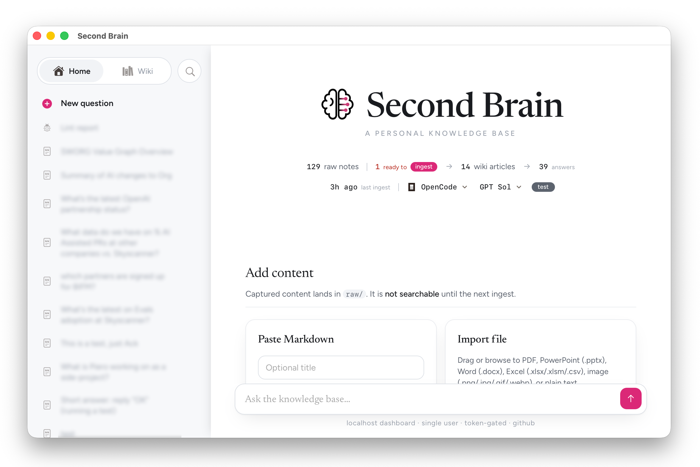
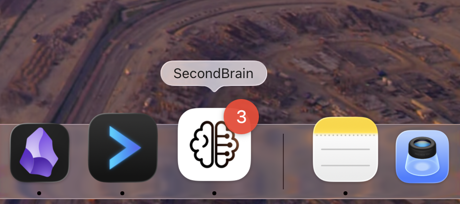

<p align="center">
  
</p>

<h1 align="center">
  
</h1>

<p align="center">
  Feed it what you read and think. It builds you a private, organised wiki<br/>
  you can ask questions, and every answer comes with its sources.
</p>

<p align="center">
  <a href="#get-started"><b>Get started ↓</b></a> &nbsp;·&nbsp;
  <a href="#using-it">Using it</a> &nbsp;·&nbsp;
  <a href="#prefer-the-terminal">CLI</a> &nbsp;·&nbsp;
  <a href="#works-with-your-agent">Engines</a>
</p>

<p align="center">
  
</p>

## What it is

A knowledge base that lives in a folder on your computer. You do three things:

- **Import** anything — a note, a PDF, a web page, a slide deck, a spreadsheet, an image.
- **It organises** — everything gets folded into a cross-linked wiki, automatically.
- **Ask** — natural-language questions, answered from *your* material, with sources.

It runs through an AI agent you already have: **Claude Code** by default (also Codex or OpenCode). Everything stays in your folder; the only thing that leaves your machine is the text your agent sends its model to do the organising and answering.

## Get started

No need to know your way around GitHub. Your agent does the setup for you.

**1. Get the files.** Open your favourite agent (**Claude Code** or **Codex**) and paste this in:

```
Clone https://github.com/PieroSierra/SecondBrain and tell me where you saved it.
```

**2. Set it up.** Reopen your agent in that new **SecondBrain** folder, then paste:

```
Run the second-brain setup.
```

It asks a couple of questions about your interests, writes your config, and you're done. *(Not sure how to reopen your agent in the folder? Just ask it: "how do I reopen you inside the SecondBrain folder?")*

**3. Get the app.**

<p align="center">
  <a href="https://github.com/PieroSierra/SecondBrain/releases/latest"><b>⬇ Download SecondBrain.app</b></a>
</p>

Just download it and drag it into your Applications folder. Launch it, point it at your **SecondBrain** folder, and it runs everything for you: no terminal, no restart juggling. Now just import something, click **Update wiki**, and ask a question.

<p align="center">
  
</p>

## Using it

The everyday loop, all from the dashboard:

- **Capture** — paste a Markdown note, drop or pick a file (PDF, PowerPoint, Word, Excel, CSV, image, text), import from a URL, or pull a document from Craft. Office and CSV files convert instantly, in-process, with no model call.
- **Update wiki** — when new material is waiting, a row appears telling you how many items aren't searchable yet, with an **Update wiki** button. Click it and your wiki is rebuilt and cross-linked.
- **Ask** — type a question in the hero box and read the sourced answer right on the page. Past answers and articles stay browsable in the sidebar.
- **Tidy up** — **Run lint** flags contradictions and gaps; a plain-English edit box lets you fix any article without touching files.

**Capture straight from Chrome.** A companion extension imports the page you're on with one click, no need to open the dashboard first. [Install it in a minute →](dashboard/README.md#chrome-extension)

## How it's organised

Behind the app, content flows one way through three folders:

| Folder     | What's in it                                                       |
| ---------- | ------------------------------------------------------------------ |
| `raw/`     | Everything you capture. Append-only — never modified by AI.        |
| `wiki/`    | The AI-organised topic articles, cross-linked. Rebuilt on ingest.  |
| `outputs/` | Your query answers and lint reports, dated and saved.              |

`raw/` → **ingest** → `wiki/` → **query** → `outputs/`. The app just puts buttons on that flow.

## Prefer the terminal?

Every operation is an [agent skill](https://agentskills.io) you can run directly. In **Claude Code** or **OpenCode** they're `/`-prefixed; in **Codex**, swap the `/` for `$`.

| Command | What it does |
|---|---|
| `/second-brain-import-md` | Save a pasted Markdown note into `raw/` |
| `/second-brain-import-file "<path>"` | Import any file — PDF, image, or text |
| `/second-brain-import-web <url>` | Fetch a web page into `raw/web/` |
| `/second-brain-import-craft Folder/DocumentName` | Pull a named note from Craft |
| `/second-brain-ingest` | Fold new `raw/` content into the wiki, rebuild the index |
| `/second-brain-lint` | Scan the wiki for contradictions, unsupported claims, and gaps |
| `/second-brain-edit-wiki "<prompt>"` | Apply a natural-language edit to wiki articles |
| `/second-brain-query "your question"` | Ask the knowledge base; answer saved to `outputs/` |

You can also just drop files into `raw/` and run `/second-brain-ingest`. Ingest is explicit: new content doesn't appear in the wiki until you run it.

Needs **Python 3** (macOS system Python is fine, no `pip install`).

## Works with your agent

Second Brain runs the *same* skills on three agent CLIs. Pick whichever you use:

- **Claude Code** *(default)* — `claude`
- **Codex** — `codex`
- **OpenCode** — `opencode` (including the free OpenCode Zen models)

Set `AGENT_ENGINE` in a `.env` file at the vault root (`claude` / `codex` / `opencode`) and restart. The dashboard's status bar shows the active engine, and you can switch model tiers from its menu.

> The engines enforce their sandbox differently. Claude Code denies shell/network and path-scopes writes to the vault; Codex and OpenCode confine writes to the vault but **can** run shell commands inside it. Read the [security model](dashboard/README.md#security-model) before using any engine on untrusted content.

## Configuration (`.env`)

Create a `.env` file at the vault root to override defaults without editing any code:

```
# Which agent CLI backs the skills: claude (default), codex, or opencode.
AGENT_ENGINE=claude

# Use a different claude binary (e.g. a Max subscription account):
CLAUDE_BIN=claude-personal

# Use a different codex binary (used when AGENT_ENGINE=codex):
CODEX_BIN=codex

# Use a different opencode binary (used when AGENT_ENGINE=opencode):
OPENCODE_BIN=opencode

# Show the Craft import card in the dashboard (Craft MCP must be configured for your engine):
CRAFT_ENABLED=1
```

The `.env` file is gitignored, so it never leaves your machine.

There are two further settings, `REMOTE_HOSTS` and `REMOTE_READ_ONLY`, used only
if you want to reach the dashboard from another device — see [Remote access](#remote-access).

## Remote access

*Optional and advanced — skip this unless you specifically want the dashboard on
your phone or another machine. Nothing above requires it.*

The bridge binds `127.0.0.1` and refuses to bind anything else. That is not an
oversight to work around — `POST /run` runs an agent CLI with file-system access,
and the token that authorizes it is served in the HTML of an ungated page, so
anything that can load `/` can drive it. That model is sound when reaching `/`
already means being on the machine. It is a remote-code-execution dispenser the
moment it is reachable by strangers.

So the supported way to use it from a phone or laptop is to put a proxy in front
that is *itself* access-controlled, and leave the bind alone. [Tailscale
Serve](https://tailscale.com/kb/1312/serve) is the easy version: your tailnet
becomes the authentication, nothing is published to the internet, and you get a
real HTTPS certificate.

```bash
tailscale serve --bg 4173          # https://<machine>.<tailnet>.ts.net
```

Then add that hostname to `REMOTE_HOSTS` in `.env` and restart the bridge — the
proxy forwards the original `Host` header, and the bridge rejects any hostname
it was not explicitly told about. The dashboard itself needs no changes; its
fetches are all relative.

Two things not to do:

- **Do not use `tailscale funnel`.** Same command family, public listener, and
  every reason above applies.
- **Do not add a publicly-resolvable hostname to `REMOTE_HOSTS`.** Putting this
  on the open internet is not a configuration change; it starts with replacing
  the token-in-the-HTML auth model.

**Remote access is read-only by default.** Once `REMOTE_HOSTS` is set, remote
callers can browse, search and read the wiki, but cannot run a skill, upload,
edit or delete. Local use is unaffected either way. Requests count as remote when
they carry the `X-Forwarded-For` header the proxy adds.

To allow remote callers to run queries and imports too, set `REMOTE_READ_ONLY=0`
— but do that only once you are confident the proxy in front of the bridge really
does authenticate, because that endpoint runs an agent CLI on your machine.

### Keeping it up without the app

By default the bridge is a child of the app, so quitting the app takes the
dashboard down with it — awkward when the point is to reach it from elsewhere.
`launchd/install.sh` (macOS) hands ownership to `launchd` instead, with restart
on crash and on reboot:

```bash
./launchd/install.sh              # install
./launchd/install.sh --uninstall  # back to an app-owned bridge
```

The app then *adopts* the running bridge rather than spawning its own. Note the
side effect: an adopted bridge gets no environment injection, so the app's
Engine and Model menus stop taking effect and `.env` becomes the only dial.

## Troubleshooting

| Symptom | Fix |
|---|---|
| "Connection refused" in the browser | The bridge isn't running; start it with `./run.sh`. |
| `claude: command not found` in the bridge log | Ensure `claude` is on the PATH of the shell that launches the bridge, or set `CLAUDE_BIN` in `.env`. |
| `codex: command not found` in the bridge log | With `AGENT_ENGINE=codex`, ensure `codex` is on the PATH, or set `CODEX_BIN` in `.env`. |
| `opencode: command not found` in the bridge log | With `AGENT_ENGINE=opencode`, ensure `opencode` is on the PATH, or set `OPENCODE_BIN` in `.env`. |
| Long operation returns 504 | The skill timed out. Run the same prompt directly to debug: `claude -p "/second-brain-query \"...\"" --output-format json`. |
| Status bar "agent" tile wrong, or a `.env` change ignored | The engine is read at startup; restart the bridge (`./run.sh`) after editing `AGENT_ENGINE`. |
| 409 Busy | Another operation is in flight; wait for it to finish. |
| Status strip shows `—` | `raw/.ingest-manifest.json` is missing; run `/second-brain-ingest` once to create it. |

For the dashboard's security model, permissions, and port options, see [dashboard/README.md](dashboard/README.md).

## Project layout

```
SecondBrain/
├── raw/                        Source content (ingest-read-only; importers may update)
│   ├── craft/                  Notes imported from Craft
│   ├── pdf/                    Text extracted from PDFs
│   ├── pptx/                   Markdown extracted from PowerPoint decks
│   ├── docx/                   Markdown extracted from Word documents
│   ├── xlsx/                   Markdown tables extracted from Excel workbooks
│   ├── csv/                    Markdown tables extracted from CSV files
│   ├── images/                 Visual descriptions of imported images
│   ├── web/                    Pages fetched by web-import
│   └── .ingest-manifest.json   Machine-managed ingestion state
├── wiki/                       AI-organised topic articles
│   └── INDEX.md                Master topic index (rebuilt on every ingest)
├── outputs/                    Query answers, lint reports, ingest reports
├── .claude/skills/             Agent skills (Codex and OpenCode read them via the .agents/skills link)
│   ├── second-brain-query/        ask the knowledge base
│   ├── second-brain-ingest/       fold raw/ into wiki/
│   ├── second-brain-lint/         scan the wiki for issues
│   ├── second-brain-edit-wiki/    apply natural-language edits to articles
│   ├── second-brain-import-{md,web,pdf,file,craft}/   capture content
│   └── second-brain-setup/        first-time configuration
├── dashboard/                  Local web UI
│   ├── bridge.py               Python stdlib HTTP server + claude/codex/opencode proxy
│   ├── index.html              Single-page dashboard
│   ├── styles.css              Visual design
│   ├── app.js                  Front-end controller
│   ├── fonts/                  Self-hosted Newsreader + Figtree webfonts (OFL)
│   ├── lib/marked.min.js       Vendored Markdown renderer
│   └── lib/purify.min.js       Vendored DOMPurify (HTML sanitiser)
├── chrome-extension/           Browser extension (load unpacked in Chrome)
├── macos-app/                  Native macOS app that runs the dashboard (Swift source + scripts)
├── launchd/                    macOS LaunchAgent so the bridge outlives the app (see Remote access)
├── run.sh                      Start the dashboard (idempotent port cleanup)
├── CLAUDE.md                   Vault schema + your declared interests (gitignored)
├── CLAUDE.md.example           Template to copy when setting up a new vault
├── .env                        Local overrides (gitignored)
└── specs/                      Feature specs and implementation plans
```

## Learn more

- **[dashboard/README.md](dashboard/README.md)** — the web UI, security model, permissions, ports, and troubleshooting.
- **[macos-app/README.md](macos-app/README.md)** — the native macOS app: building, installing, switching engines.
- **[specs/002-interactive-dashboard/](specs/002-interactive-dashboard/)** — feature spec, plan, and the bridge HTTP contract.

## Contributing

This is a personal project I keep public so others can use it. Forks are welcome and I'm glad if it's useful to you.
